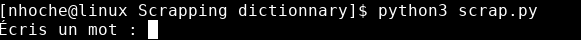
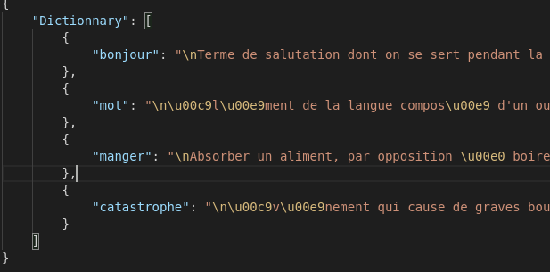

<h1 align="center">
    Workshop - Scrapping Web Python
</h1>

<p align="center">
    
</p>
<br>

<h3 align="center">
    The objective of this workshop is to learn how to <br> scrap a web page.
</h3>
<br><br>

### **What's a scrap?**
Scrapping is the action of collecting source code of a web page, with a program.
<br><br>

### **What's a user-agent?**
A user-agent is like an ID card, where you can find the name of your web browser and information on your OS.<br>
You can find your user agent while typing 'what's my user agent' on your browser.
<br><br>

# **Objectif of this workshop**
In this workshop, we are going to make a dynamic french dictionnary with the website: https://www.larousse.fr/.
<br><br>

# **Get started**

## **Exo0 - Check robots.txt**
In a first time go to:
```
https://www.larousse.fr/robots.txt
```
This web page serve to website's owner to indicate to bot what they can do.
For this workshop we want to use this type of url:
```
https://www.larousse.fr/dictionnaires/francais/exemple
```
1. Is it autorised?
2. Is your user-agent is blocked?

> You can replace 'exemple' by the word you want.

<br><br>

## **Exo1 - Create user interaction**
Now that we know that our objective is possible, we are going to create a user interaction.<br>
This user input is the word that the user want to search.

We are going to use this fonction to get user input:
```python
input()
```



<br>

## **Exo2 - Get page content**
We need to get page content, let's try to get this with request library:
```python
import requests
```

<br>

## **Exo3 - Check http error code**
To avoid errors, we want to do next exercise only if request is ok.<br>
You can find type of this code in this link:
```
https://fr.wikipedia.org/wiki/Liste_des_codes_HTTP
```

<br>

## **Exo4 - Get Definition**
In this part, we are going to select definition in page's content.<br>
You need to use 'BeautifulSoup' parser to automatically parse to utf-8, and easly do a small html parsing.<br>
For specific parsing you can use XPath or regex.

Print the definition and print "Mot non trouvé." if the word is not found.

> You can use the website "https://regex101.com/" to get more information on regex and a real time using.

<br>

## **Exo5 - Don't loose definition**
We are going to create a small memory system, create the file "memory.json" and use this json to save automatically all the definition that you get. <br>
This is a sample of the result that you can get:



<br>

## **Exo6 - Use the memory**
Now that we have a memory, we are going to use it.<br>
Also, read the json file, check all word that you previously get and if the word asking is found, don't scrap the main page and print the stocked definition from your memory file.

<br>

# **To go further**
Now that you know how to make a simple scrap, you can try this possibility:
- create a program that scrap a product page to do a price graphic
- scrap a youtube video to get on real time information
- scrap an image bank to do a discord meme bot
